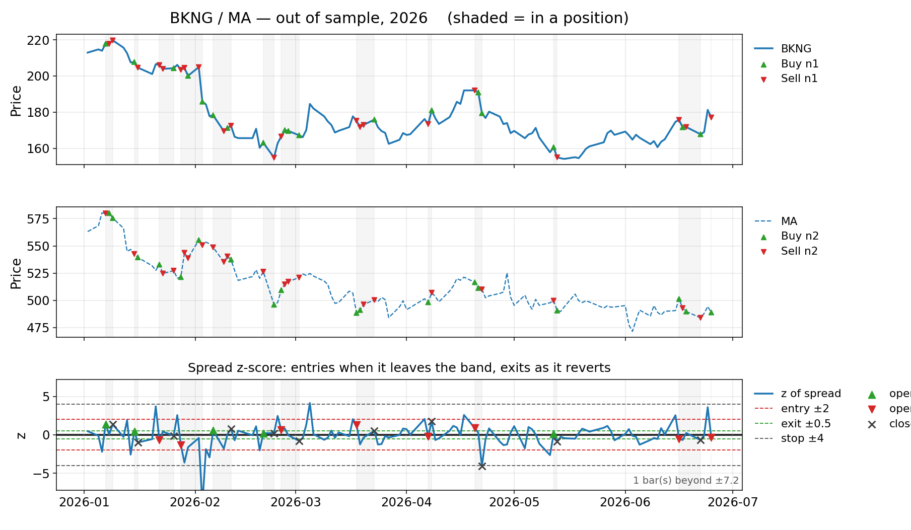
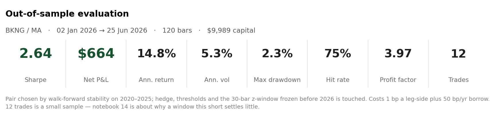

# dynamic-hedge-pairs-trading

A **pairs trading** research toolkit built as a Python package, featuring a
production-style pipeline from cointegration screening through walk-forward
validation and capacity analysis.

- Cointegration screening (Engle–Granger + Johansen dual-gate) with **Benjamini-Hochberg FDR correction**
- Kalman-filter dynamic hedge ratio `beta_t`, intercept `alpha_t`, residual `epsilon_t`
- Stationarity diagnostics (ADF, KPSS, half-life) + composite pair scoring
- Signal generation (z-score thresholds, stops, cooldowns)
- Evaluation & PnL with a flexible cost model incl. **square-root market impact**
- **Walk-forward validation** — rolling OOS folds, no look-ahead; also **drives pair selection** by cross-fold Sharpe stability (the composite score is only a pre-filter)
- **Circuit breaker** — post-processor that flattens positions on z-score blow-outs or rolling drawdown breach, with configurable cooldown and re-entry guard
- **Portfolio analytics** — cross-pair spread-return correlation matrix, diversification score, inverse-variance position weights
- **Hedge ratio stability tests** — CUSUM level-shift test + rolling β-drift detection; flags structurally shifted pairs
- **Universe-wide cointegration visualisation** — p-value heatmap, network graph, half-life diagnostics
- Plotting of trades over price legs

<p align="center">
    
    &nbsp;&nbsp;
    
</p>
<p align="center"><em>Backtest on out-of-sample data. See the <a href="notebooks/pairs_trading_01.ipynb">notebook</a>.</em></p>

---

## Notebooks

| Notebook | Purpose |
|----------|---------|
| [`pairs_trading_01.ipynb`](notebooks/pairs_trading_01.ipynb) | Original walkthrough — cointegration → Kalman → signals → IS/OOS evaluation, plus FDR demo, walk-forward, parameter sensitivity, and regime analysis sections |
| [`pairs_trading_02.ipynb`](notebooks/pairs_trading_02.ipynb) | **Revised clean workflow** — the conceptual spine, end-to-end: cointegration screen → Kalman hedge → **walk-forward pair selection** (§3.5; composite score is only a pre-filter) → in-sample **and OOS** evaluation with trade plots → honest limitations. Advanced layers are kept out of the spine: circuit breaker, portfolio analytics, hedge-ratio stability and capacity/market-impact live in the package API (with test coverage), while parameter sensitivity and regime analysis are also demonstrated in `pairs_trading_01.ipynb` |
| [`pairs_trading_03.ipynb`](notebooks/pairs_trading_03.ipynb) | **No-BH ablation** — the *same* full pipeline as nb02 (screen → Kalman → walk-forward pair selection → in-sample & OOS backtests with signals and performance metrics → limitations) with **one deliberate change: no Benjamini-Hochberg correction** (`fdr_method="none"`, raw p-values). Isolates the effect of dropping multiple-testing control on selection and performance |
| [`visualize_cointegrated_pairs.ipynb`](notebooks/visualize_cointegrated_pairs.ipynb) | **Universe-wide visualisation** — BH FDR screening across NDX universe, p-value heatmap, cointegration network (Kamada-Kawai, hub detection), clustered heatmap, half-life diagnostics, and per-ticker partner query |

---

## Package layout

```text
repo-root/
│
├─ environment.yml
├─ README.md
│
├─ pairs/
│  ├─ __init__.py
│  ├─ market_data/           # load_prices(), load_universe() (data adapters)
│  │  ├─ openbb_history.py
│  │  └─ polygon_lake.py
│  │
│  ├─ universes/             # ticker list files
│  │
│  ├─ stats/
│  │  ├─ cointegration.py    # find_cointegrated_pairs_dualgate() + benjamini_hochberg_fdr()
│  │  ├─ transforms.py
│  │  ├─ stationarity.py     # ADF/KPSS, half-life, summary
│  │  ├─ portfolio.py        # pair_return_correlations(), portfolio_diversification_score(), suggest_position_weights()
│  │  └─ stability.py        # cusum_beta_stability(), rolling_beta_drift(), summarize_hedge_ratio_stability()
│  │
│  ├─ models/
│  │  └─ kalman.py           # fit_kalman_hedge(), filter_kf_on_new(), continue_kalman_*()
│  │
│  ├─ strategies/
│  │  ├─ signals.py          # zscore_from_spread(), generate_pair_signals()
│  │  ├─ evaluate.py         # evaluate_pair_signals(), market_impact_bps()
│  │  └─ circuit_breaker.py  # apply_circuit_breaker(), CircuitBreakerConfig
│  │
│  ├─ validation/            # ← new
│  │  └─ walk_forward.py     # walk_forward_splits(), walk_forward_backtest(), summarize_walk_forward()
│  │
│  └─ plotting/
│     └─ pair_trades.py      # plot_pair_legs_with_trades()
│
├─ notebooks/
│  ├─ pairs_trading_01.ipynb
│  ├─ pairs_trading_02.ipynb
│  └─ visualize_cointegrated_pairs.ipynb   # universe-wide screening & network visualisation
│
├─ cache/                               # auto-created; gitignored
│  ├─ viz_prices.parquet                # cached price data (visualisation nb)
│  ├─ viz_screen.pkl                    # cached screening results
│  └─ viz_kalman.pkl                    # cached Kalman states
│
└─ tests/                    # 251 passing tests
   ├─ test_cointegration.py
   ├─ test_evaluate.py
   ├─ test_fdr.py
   ├─ test_market_impact.py
   ├─ test_walk_forward.py
   ├─ test_circuit_breaker.py # circuit breaker (45 tests)
   ├─ test_portfolio.py       # pair correlation & weights (26 tests)
   ├─ test_stability.py       # hedge ratio stability (32 tests)
   └─ ...
```

---

## Installation

**1) Create the Conda env (recommended):**
```bash
conda env create -f environment.yml
conda activate stat-arb
```

**2) Install the package (editable for development):**
```bash
pip install -e .
```

In Jupyter, enable auto-reload during development:
```python
%load_ext autoreload
%autoreload 2
```

---

## Expected data format

Most functions expect a **long-form** price table.

- **Index:** `MultiIndex` with levels `('ticker', 'datetime')`
- **Columns:** must include `'close'`
- **Sorting:** sorted by `('ticker', 'datetime')`

```python
df_prices.index.names = ["ticker", "datetime"]
df_prices = df_prices.sort_index(level=["ticker", "datetime"])
```

```python
prices_wide = df_prices.pivot_table(
    index=df_prices.index.get_level_values("datetime"),
    columns=df_prices.index.get_level_values("ticker"),
    values="close",
    aggfunc="last",
)
```

---

## Quickstart (end-to-end)

```python
from pairs import (
    # screening
    find_cointegrated_pairs_dualgate,
    benjamini_hochberg_fdr,
    # modeling
    fit_kalman_hedge, filter_kf_on_new,
    # stats & selection
    summarize_spread_stationarity_joblib,
    # portfolio analytics
    pair_return_correlations, portfolio_diversification_score,
    suggest_position_weights,
    # hedge ratio stability
    cusum_beta_stability, rolling_beta_drift,
    summarize_hedge_ratio_stability,
    # signals & evaluation
    generate_pair_signals, evaluate_pair_signals,
    market_impact_bps,
    # risk management
    apply_circuit_breaker, CircuitBreakerConfig,
    # walk-forward validation
    walk_forward_backtest,
    # plotting
    plot_pair_legs_with_trades,
)
```

```python
cut = "2022-12-31"
df_train = df_prices.loc[pd.IndexSlice[:, :cut], :]
df_test  = df_prices.loc[pd.IndexSlice[:, cut:], :]
```

**1) Cointegration screening with BH FDR correction**
```python
screen = find_cointegrated_pairs_dualgate(
    df_train, alpha_eg=0.05, alpha_joh=0.05,
    fdr_method="bh",   # Benjamini-Hochberg (default)
    only_pass=True,
)
candidates = list(screen.index)   # list of (ticker1, ticker2)
```

**2) Fit Kalman on train**
```python
states_tr, params_tr = fit_kalman_hedge(
    df_train, pairs=candidates,
    mode="smooth", em_iters=5, q=1e-5,
    return_params=True,
)
```

**3) Stationarity scoring → candidate shortlist → walk-forward selection**

The composite stationarity score is a *pre-filter* that yields a candidate shortlist; the
traded pair is then chosen by **walk-forward cross-fold Sharpe stability** over the training
span (see `pairs_trading_02.ipynb` §3.5), never by in-sample ranking alone. The OOS/test
window is never consulted during selection. Minimal self-contained version:
```python
summary_tr = summarize_spread_stationarity_joblib(states_tr, alpha=0.05)
shortlist  = list(summary_tr.sort_values(["verdict", "adf_p"]).index[:15])  # pre-filter only
# Recommended: rank `shortlist` by walk-forward cross-fold Sharpe (notebook §3.5),
# then take the most stable pair instead of the top in-sample row:
pair = shortlist[0]
t1, t2 = pair
```

**4) Continue Kalman on OOS (causal — no look-ahead)**
```python
frozen     = {k: params_tr[pair][k] for k in ("F", "Q", "R")}
last_state = (params_tr[pair]["last_state_mean"], params_tr[pair]["last_state_cov"])
states_te, _ = filter_kf_on_new(
    df_test.loc[(t1,), "close"],
    df_test.loc[(t2,), "close"],
    frozen=frozen, last_state=last_state, mode="filter",
)
```

**5) Build pair frame, generate signals**
```python
prices_wide = df_test.pivot_table(
    index=df_test.index.get_level_values("datetime"),
    columns=df_test.index.get_level_values("ticker"),
    values="close",
)
df_pair = states_te.join(
    prices_wide[[t1, t2]].rename(columns={t1: "P1", t2: "P2"}), how="inner"
)
signals = generate_pair_signals(
    df_pair, z_method="robust",
    z_entry=2.0, z_exit=0.5, z_stop=4.0,
    capital_per_pair=10_000,
)
```

**6) Evaluate with realistic costs**
```python
daily, trades, summary = evaluate_pair_signals(
    df_pair, signals,
    cost_bps=2.0,
    borrow_bps_per_year=50,
    avg_daily_volume_1=2_000_000,   # market impact (optional)
    avg_daily_volume_2=2_000_000,
    impact_eta=0.14,
)
print(f"Sharpe: {summary['sharpe']:.2f}  |  Impact cost: ${summary['impact_cost_total']:,.0f}")
```

**7) Walk-forward validation**
```python
wf_results = walk_forward_backtest(
    df_pair[["P1", "P2"]],
    train_bars=504, test_bars=126, step_bars=63,
    fit_fn=my_fit_fn,
    signal_fn=my_signal_fn,
    eval_fn=my_eval_fn,
)
# wf_results is a DataFrame with one row per fold
print(wf_results[["sharpe", "ann_return", "n_trades"]])
```

---

## Methodology

```
Universe (S&P 500 + NASDAQ-100, ~517 tickers)
      │
      ▼
Dual-gate cointegration screen
  Engle-Granger  ──┐
                   ├─► both must pass  ──► BH FDR correction (controls false discovery rate)
  Johansen       ──┘
      │
      ▼
Kalman filter (EM-fitted Q, R)
  time-varying beta_t, alpha_t  ──► spread residual epsilon_t
      │
      ├─► Hedge ratio stability tests
      │     CUSUM level-shift test + rolling β-drift  ──► flag / exclude unstable pairs
      │
      ▼
Stationarity scoring (ADF, KPSS, half-life, sigma)
  Composite z-score ranking ──► candidate shortlist (pre-filter only)
      │
      ▼
Walk-forward pair selection
  rolling train/test folds over the training span
  ──► rank by cross-fold Sharpe stability ──► traded pair chosen
  (test window never consulted for selection)
      │
      ▼
Portfolio analytics (multi-pair)
  Spread-return correlation matrix ──► diversification score
  Inverse-variance weights ──► capital allocation per pair
      │
      ▼
Signal generation
  z-score (rolling / robust) ──► entry / exit / stop thresholds
      │
      ▼
Circuit breaker (post-processor)
  z-score blow-out  ──┐
                      ├─► force flat + cooldown ──► patched signals
  Rolling drawdown  ──┘
      │
      ▼
Evaluation
  flat costs (bps, per-share, borrow) + square-root market impact
      │
      ├─► In-sample metrics (Sharpe, Ann. Return, Max Drawdown, ...)
      ├─► OOS evaluation (causal Kalman continuation, no look-ahead)
      ├─► Walk-forward validation (rolling folds, OOS Sharpe distribution)
      ├─► Parameter sensitivity heatmap (z_entry × z_exit)
      ├─► Regime-conditional analysis (COVID / Rate shock / AI bull)
      └─► Capacity analysis (Sharpe vs position size)
```

### Universe-wide visualisation pipeline (`visualize_cointegrated_pairs.ipynb`)

```
NDX universe (~100 tickers)  →  load_universe("ndx") + load_prices()  [parquet cache]
      │
      ▼
find_cointegrated_pairs_dualgate(fdr_method="bh")               [pickle cache]
  ├─► FDR audit: raw vs BH-corrected counts, expected false discoveries
  │
  ▼
p-value matrix (BH-adjusted eg_p_fdr, axis-aligned)
  ├─► Heatmap (seaborn, sorted tickers)
  ├─► Network graph (Kamada-Kawai layout, hub detection at 90th-percentile degree)
  └─► Clustered heatmap (hierarchical linkage)
      │
      ▼
Kalman → summarize_spread_stationarity_joblib()                 [pickle cache]
  ├─► Half-life histogram (tradeable 5–30 bar band highlighted)
  ├─► ADF p-value scatter
  └─► Per-ticker partner query (eg_p_fdr, joh_stat, halflife, verdict)
```

---

## Top-level API

Import directly from `pairs` (lazy-loaded, startup fast):

### Stats
| Function | Returns |
|----------|---------|
| `find_cointegrated_pairs_dualgate(data, *, fdr_method="bh", ...)` | DataFrame of pair metrics; `eg_p_fdr` column for BH-adjusted p-values |
| `benjamini_hochberg_fdr(pvalues, alpha=0.05)` | `(reject: bool array, pvalues_adj: float array)` |
| `summarize_spread_stationarity_joblib(states, ...)` | DataFrame with `adf_p`, `kpss_p`, `halflife`, `resid_sigma`, `verdict` |
| `estimate_halflife(series)` | `float` |
| `test_spread_stationarity(series, ...)` | `dict` |
| `pair_return_correlations(kf_results, *, method, min_overlap)` | Symmetric N×N DataFrame of cross-pair Δresid correlations |
| `portfolio_diversification_score(corr_matrix)` | `float` — diversification ratio (1 / mean\|ρ_off-diag\|); >3 = well diversified |
| `suggest_position_weights(kf_results, corr_matrix, *, method, max_weight)` | DataFrame with `pair`, `resid_var`, `weight`, `suggested_capital_pct` |
| `cusum_beta_stability(beta, *, alpha)` | `dict` with `cusum_stat`, `critical_val`, `is_stable`, `cusum_series` |
| `rolling_beta_drift(beta, *, window, threshold_sigma)` | `dict` with `max_roll_std_ratio`, `is_stable`, `flagged_dates`, `roll_std_series` |
| `summarize_hedge_ratio_stability(kf_results, ...)` | DataFrame indexed by `(ticker1, ticker2)` with `overall_stable` column |

### Models
| Function | Returns |
|----------|---------|
| `fit_kalman_hedge(data, pairs, *, mode, em_iters, return_params)` | `(states_dict, params_dict)` |
| `filter_kf_on_new(P1_new, P2_new, *, frozen, last_state, mode)` | `(states_df, last_state_dict)` |
| `continue_kalman_on_window(data, k1, k2, params, ...)` | `(states_df, params_dict)` |

### Strategies
| Function | Returns |
|----------|---------|
| `generate_pair_signals(df_pair, *, z_entry, z_exit, z_stop, ...)` | signals DataFrame with `n1`, `n2`, `pos` |
| `evaluate_pair_signals(df_pair, signals, *, cost_bps, avg_daily_volume_1, ...)` | `(daily_df, trades_df, summary_dict)` |
| `market_impact_bps(shares_traded, price, avg_daily_volume, ann_vol_bps, eta)` | `float` or array — dollar impact |
| `zscore_from_spread(spread, method="robust", ...)` | `pd.Series` |
| `apply_circuit_breaker(signals, df_pair, *, z_halt, cb_cooldown_bars, z_reentry, max_drawdown_pct, ...)` | `(signals_cb, audit_df)` — patched signals + halt window log |
| `CircuitBreakerConfig(z_halt, cb_cooldown_bars, z_reentry, max_drawdown_pct, ...)` | Convenience dataclass wrapping all circuit breaker parameters |

### Validation
| Function | Returns |
|----------|---------|
| `walk_forward_backtest(df, *, train_bars, test_bars, step_bars, fit_fn, signal_fn, eval_fn)` | DataFrame — one row per fold |
| `walk_forward_splits(index, *, train_bars, test_bars, step_bars)` | `List[(train_idx, test_idx)]` |
| `summarize_walk_forward(results, metric_cols)` | DataFrame — mean/std/median/min/max per metric |

### Plotting
| Function | Returns |
|----------|---------|
| `plot_pair_legs_with_trades(df_pair, signals, ...)` | `(Figure, (Axes, Axes))` |

---

## Representative results (illustrative pair: CCL / EXPE, 2020–2024)

| Metric | In-sample (2020–2024) | OOS (2025) |
|--------|----------------------|------------|
| Sharpe ratio | ~2.4 | ~0.5 |
| Ann. return | ~18% | ~4% |
| Max drawdown | ~8% | ~6% |
| Trades | ~70 | ~6 |

> **OOS caveat:** The 2025 OOS window contains only ~6 trades — statistically insufficient to draw firm conclusions. The Sharpe decay from 2.4 → 0.5 is real but its magnitude is uncertain. Walk-forward validation across multiple folds gives a more reliable picture.
>
> **Pair caveat:** These figures reflect a single fixed pair under the *earlier* composite-score selection. The revised notebook (§3.5) selects the traded pair by walk-forward stability, which may surface a different pair — and different numbers — on re-run.

---

## Limitations

| Gap | Notes |
|-----|-------|
| **Selection bias** | Candidates screened from a large universe; even with walk-forward-based selection (§3.5), picking the best pair on validation folds inflates expectations. The 2025 test window is held out, but validation-set selection bias remains |
| **Single-pair OOS** | ~6 OOS trades; need ≥50 for statistical power |
| **Portfolio weights are heuristic** | Inverse-variance ignores off-diagonal covariance; a minimum-variance optimizer would be more precise |
| **Circuit breaker is back-tested** | Thresholds calibrated in-sample may over-fit; validate OOS before deploying |
| **Market impact is estimated** | Square-root model calibrated to median US equities; illiquid names need higher η |
| **Regime dependence** | Strategy performs differently across COVID crash / recovery / rate shock / AI bull regimes |
| **Borrow availability** | Short borrow on hard-to-borrow names can spike to 500 bps/year |

---

## Notes & gotchas

- **Index hygiene:** Keep index names as `('ticker', 'datetime')` and ensure data are sorted.
- **No look-ahead in OOS:** `filter_kf_on_new(..., mode="filter")` uses only the causal filter — no smoother — so no future information leaks into OOS states.
- **BH FDR is the default:** `find_cointegrated_pairs_dualgate` applies Benjamini-Hochberg correction by default (`fdr_method="bh"`). Pass `fdr_method="none"` to revert to raw p-values — [`pairs_trading_03.ipynb`](notebooks/pairs_trading_03.ipynb) runs the full pipeline that way as an ablation, isolating the effect of dropping multiple-testing control. Use `"none"` only for such experiments, never to expand a tradeable candidate set.
- **EM on train only:** Freeze `F, Q, R` from training; never re-fit EM on OOS data.
- **Execution lag:** `generate_pair_signals` uses next-bar execution (backtest-safe by construction).
- **Market impact is additive:** `avg_daily_volume_1/2=None` (default) disables impact modelling; all other cost parameters remain active.
- **Walk-forward callbacks:** `fit_fn` returns an artefact, `signal_fn(df_test, artefact)` generates signals, `eval_fn(df_test, signals)` returns a flat metrics dict. Any fold where a callback raises is skipped with a warning, never aborts the run.
- **Walk-forward-driven selection:** In `pairs_trading_02.ipynb` (§3.5) the composite stationarity score is only a *pre-filter* yielding a candidate shortlist; the traded pair is selected by **walk-forward cross-fold Sharpe stability** over the training span, with the OOS/test window never consulted during selection. The selection loop is parallelised across candidates with joblib (BLAS threads pinned to 1 to avoid oversubscription).
- **Visualisation caching:** `visualize_cointegrated_pairs.ipynb` writes `cache/viz_prices.parquet`, `cache/viz_screen.pkl`, and `cache/viz_kalman.pkl` on first run. Subsequent runs load from cache and are near-instant. Delete the relevant file to force a fresh computation. The `cache/` directory is gitignored — these files are large and data-source specific.
- **Hub-node caveat:** High-degree nodes in the cointegration network (coloured red, degree ≥ 90th percentile) are often driven by a common latent factor rather than genuine pair cointegration. Treat them with extra scepticism and verify OOS behaviour before trading.
- **Circuit breaker calibration:** `z_halt` should be set at or above the `z_stop` used in signal generation. `max_drawdown_pct` thresholds that fire frequently in-sample indicate over-fitting — validate on held-out folds before deploying.
- **Hedge ratio stability:** Run `summarize_hedge_ratio_stability(states_tr)` after fitting the Kalman filter and **before** selecting pairs for live trading. Pairs flagged as `overall_stable=False` should be inspected (plot the CUSUM path) and excluded if β drift is persistent throughout the OOS window.
- **Portfolio weights:** `suggest_position_weights` uses `states_tr` (the full multi-pair Kalman dict) as input and is best re-computed periodically (e.g., monthly) since correlations between pair spreads can shift with market regime.

---

## References

- Engle, R. F., & Granger, C. W. J. (1987). *Cointegration and Error Correction: Representation, Estimation, and Testing.*
- Johansen, S. (1991). *Estimation and Hypothesis Testing of Cointegration Vectors in Gaussian Vector Autoregressive Models.*
- Kalman, R. E. (1960). *A New Approach to Linear Filtering and Prediction Problems.*
- Benjamini, Y., & Hochberg, Y. (1995). *Controlling the False Discovery Rate: A Practical and Powerful Approach to Multiple Testing.*
- Almgren, R., & Chriss, N. (2001). *Optimal Execution of Portfolio Transactions.* — square-root market impact model.
- Brown, R. L., Durbin, J., & Evans, J. M. (1975). *Techniques for Testing the Constancy of Regression Relationships over Time.* — CUSUM test for structural change.
